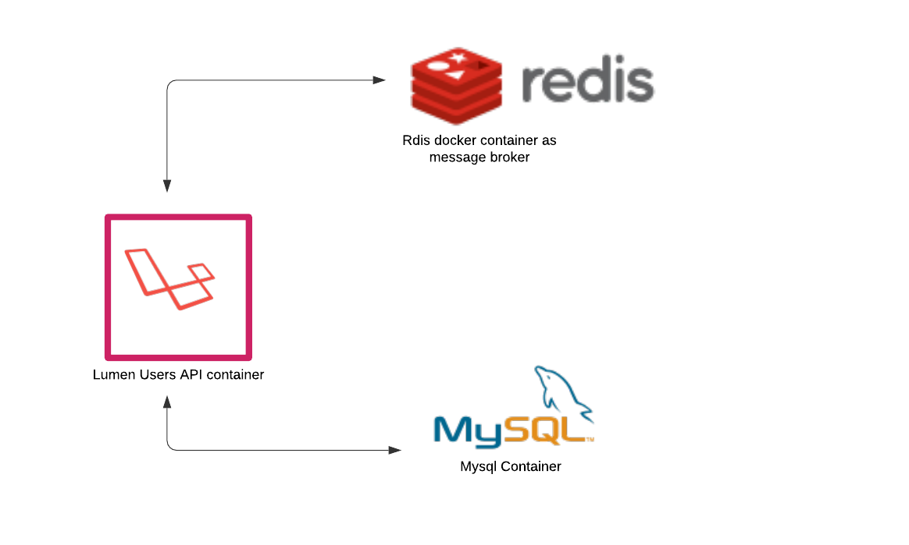

# Lumen Users API



A simple API using laravel lumen framework.

This API is just a demo of using Laravel Lumen framework to create an API and use redis websockets to broadcast events.

## Routes

```sh
+--------+-------------------+------+------------+------------+------------------------------------------------+
| Method | URI               | Name | Action     | Middleware | Map To                                         |
+--------+-------------------+------+------------+------------+------------------------------------------------+
| GET    | /                 |      | Closure    |            |                                                |
| POST   | /api/v1/user      |      | Controller |            | App\Http\Controllers\UserController@createUser |
| GET    | /api/v1/user      |      | Controller |            | App\Http\Controllers\UserController@index      |
| GET    | /api/v1/user/{id} |      | Controller |            | App\Http\Controllers\UserController@show       |
| PUT    | /api/v1/user/{id} |      | Controller |            | App\Http\Controllers\UserController@update     |
| DELETE | /api/v1/user/{id} |      | Controller |            | App\Http\Controllers\UserController@destroy    |
+--------+-------------------+------+------------+------------+------------------------------------------------+
```

## Commandline help

For now [`Makefile`](https://en.wikipedia.org/wiki/Makefile) is used for all cli commands which is just collection of some `docker-compose` and `docker` commands.
We can always use the `docker` cli commands or even use `Laravel sail` to interact with docker containers.

### Makefile

All commands are included in `Makefile`

> make

```sh
================================================
                 Lumen Users API
================================================
up              Spins up docker container
down            Tear down the docker container
recreate        Force recreate and start the docker container
dbshow          Show tables
dbschema        Dump mysql db
testbuild       Build test docker image
phpunit         Builds a new test container and runs phpunit test on it
phpunit-local   Runs phpunit from the application container.
help            Prints this help screen.
```

## PHP artisan command via `Makefile`

> make artisan migrate

```sh
docker exec -it lumen-user-api bash -c "php artisan migrate:status"
+------+--------------------------------------+-------+
| Ran? | Migration                            | Batch |
+------+--------------------------------------+-------+
| Yes  | 2020_12_27_160122_create_table_users | 1     |
+------+--------------------------------------+-------+
```

> make dbshow lumen users

```sh
docker exec -it lumen-user-api bash -c 'mysqlshow -hlumen-user-api-db -ulumen -plumen lumen users'
Database: lumen  Table: users
+------------+---------------------+--------------------+------+-----+---------+----------------+---------------------------------+---------+
| Field      | Type                | Collation          | Null | Key | Default | Extra          | Privileges                      | Comment |
+------------+---------------------+--------------------+------+-----+---------+----------------+---------------------------------+---------+
| id         | bigint(20) unsigned |                    | NO   | PRI |         | auto_increment | select,insert,update,references |         |
| name       | varchar(255)        | utf8mb4_unicode_ci | NO   |     |         |                | select,insert,update,references |         |
| email      | varchar(255)        | utf8mb4_unicode_ci | NO   |     |         |                | select,insert,update,references |         |
| created_at | timestamp           |                    | YES  |     |         |                | select,insert,update,references |         |
| updated_at | timestamp           |                    | YES  |     |         |                | select,insert,update,references |         |
+------------+---------------------+--------------------+------+-----+---------+----------------+---------------------------------+---------+
```

> make artisan migrate

> make artisan

### Send data via redis Websocket: (Demo)

[Demo: redis-cli channel subscription.](https://raw.githubusercontent.com/bhaskarkc/lumen-users-api/main/broadcasting-demo.svg)

On each API events there will be an event send out to redis websocket on channel name `users-event-channel`.

The `docker-compose` file spins up a redis docker container along with the Lumen app and mysql.

We can login into the redis container and subscribe to the channel from cli for testing. Or any other microservice can alos connecto to this container and subscribe to the channel.

> make subscribe-channel

> 
